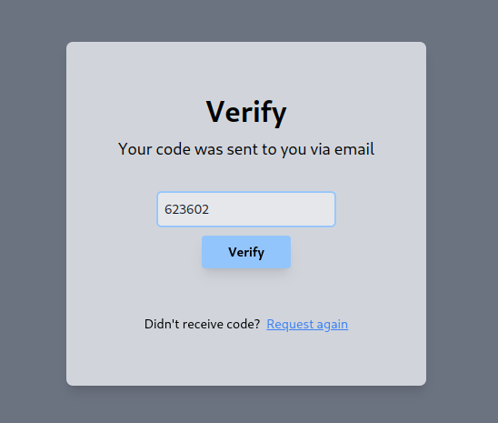

# Mock KYC Application

## Overview

This is a mock KYC (Know Your Customer) application built using Laravel. The application includes user authentication, email verification via OTP, and the ability to update user data.

## Features

- **User Authentication:** Login using email and phone number.
- **Email Verification:** OTP-based email authentication.
- **User Management:** Update user details.


## Setup

1. **Clone the repository:**
    ```sh
    git clone https://github.com/fy-st0rm/Mock-KYC.git
    cd Mock-KYC
    ```

2. **Create a .env file:**
    ```sh
    cp .env.example .env
    ```
    
3. **Setup Mailing System:**
    Update the following environment variables in .env with the credentials provided by Mailtrap:
    ```env
    MAIL_MAILER=smtp
    MAIL_HOST=sandbox.smtp.mailtrap.io
    MAIL_PORT=2525
    MAIL_USERNAME=<your_mailtrap_username>
    MAIL_PASSWORD=<your_mailtrap_password>
    MAIL_FROM_ADDRESS=noreply@example.com
    MAIL_FROM_NAME="${APP_NAME}"
    ```

4. **Install the dependencies:**
    ```sh
    npm install
    composer install
    ```
    
5. **Generate Application Key:**
    ```sh
    php artisan key:generate
    ```

6. **Run Database Migrations:**
    ```sh
    php artisan migrate --seed
    ```

7. **Run the project:**
    ```sh
    composer run dev
    ```

## How to use

1. **Go to** ```http://localhost:8000```

2. Get the dummy credentials from the database.
    

3. **Login** using the credentials
    

4. Check your **Mailtrap** inbox for the **OTP Mail**
    

5. **Verify** the given otp.
    

6. Once verified you'll be redriected to the **home page**,
where user data is displayed and can be updated.
    